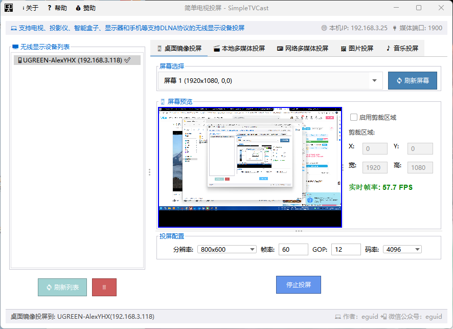
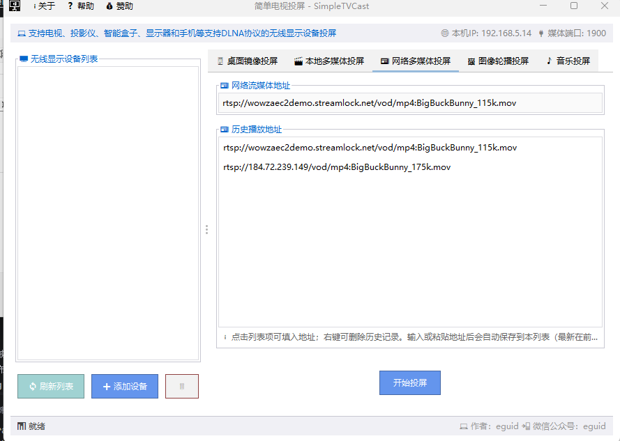
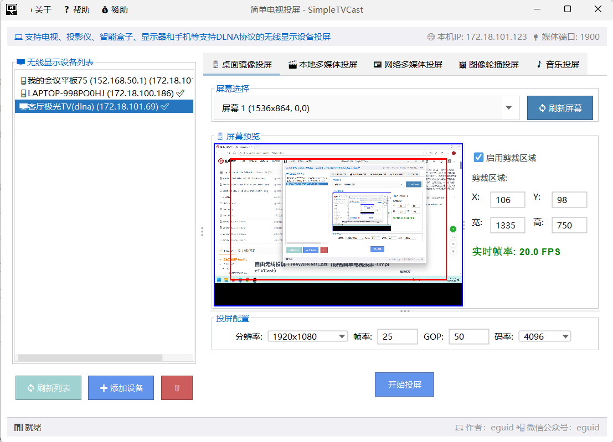
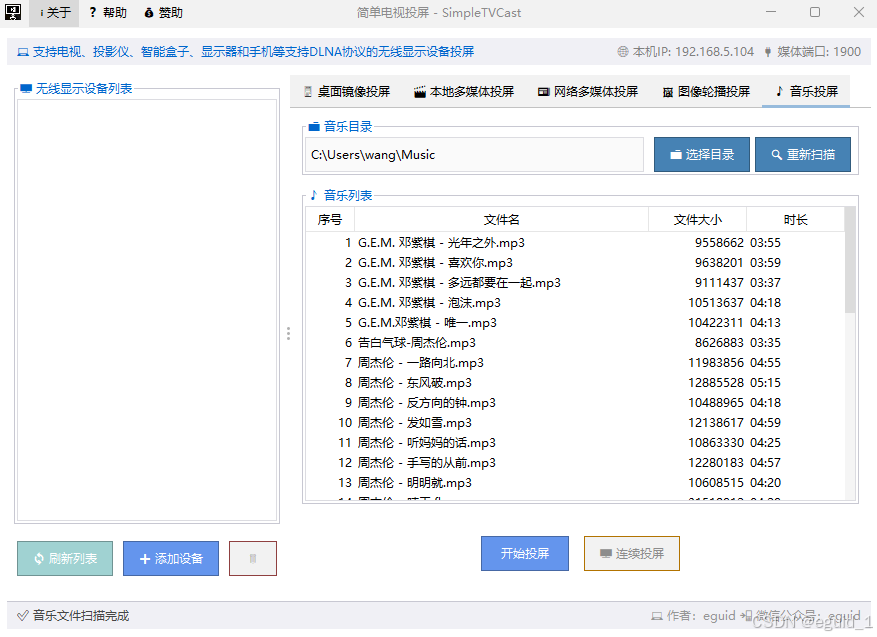
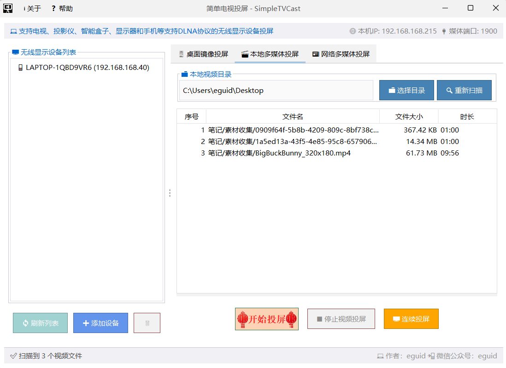
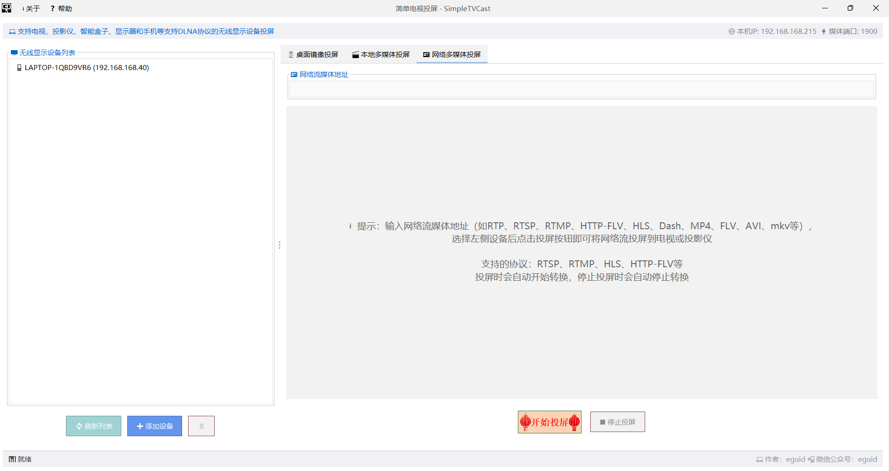
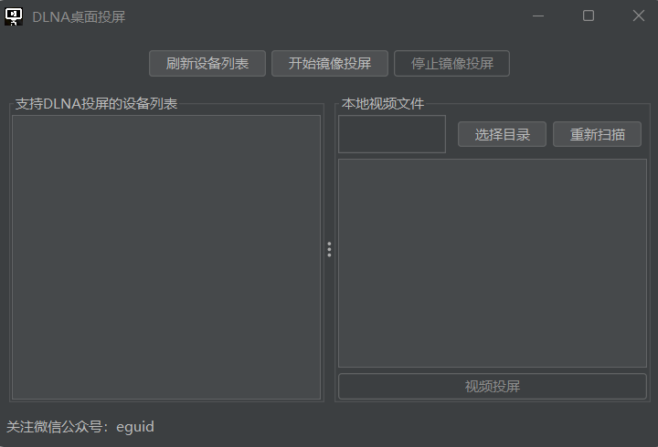
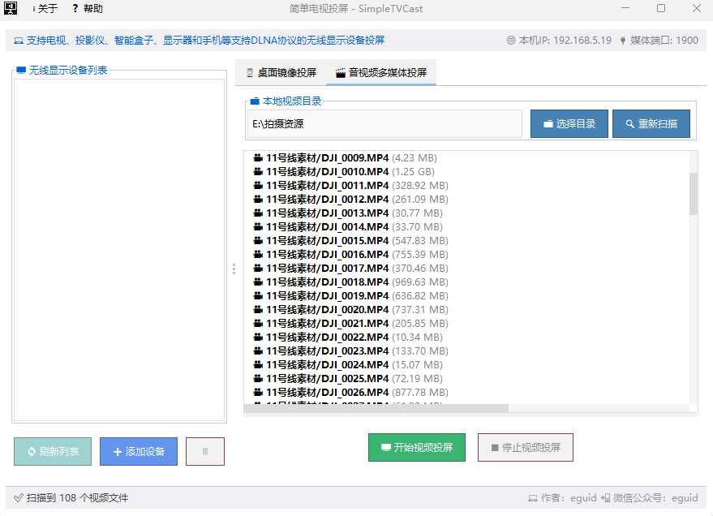

# 自由无线投屏-FreeWirelessCast（原名简单电视投屏-simpleTVCast）
”自由无线投屏-FreeWirelessCast（原名简单电视投屏-simpleTVCast）“一款免费、无广告的纯净无线投屏工具，支持电脑桌面镜像投屏和本地视频文件投屏、音乐投屏、网络多媒体投屏、图片轮播投屏等多种电视投屏方式。

`简单电视投屏6.0.0将改名为”自由无线投屏-FreeWirelessCast“。之前从1.0.0到5.1.0一直叫”简单电视投屏“，但是市面上已经有重复名字的软件了，为了以示区别，下个大版本我们将正式改名”自由无线投屏-FreeWirelessCast“。`

## 为何自由？
- “即开即投”。

免费、无广告、无水印、不限制画质。打开即投，纯净如你所见。


## 为何简单？
- “化繁为简”。
我们让无线电视投屏像开关灯一样简单，回归简单与纯粹。
无需任何设置，只需点一下“开始投屏”即可投屏。投屏操作只提供了一个“开始投屏”按钮，开始投屏后会文字会变成停止投屏，没有任何学习负担，傻瓜式操作。

## 投屏设备支持情况

通过'自由无线投屏'工具可以将电脑桌面图像、电脑本地usb连接的U盘、移动硬盘、远程硬盘等本地视频资源和互联网视频资源（支持网络摄像机实时播放地址）投屏到电视上进行播放。
4.0.0版本开始支持图片轮播投屏，还支持多显示器用户多屏幕下拉选择其中一个屏幕进行投屏，支持手动调整投屏视频编码参数。

`软件支持：智能电视、智慧屏、投影仪、无线电视机顶盒、智能盒子、智能音箱（小爱、小度等等）等支持DLNA协议的无线显示设备。`
`一点建议：建议本软件与系统内置的miracast无线投屏配合起来使用，因为系统自带无线投屏的延迟最小，毋庸置疑的是我们这款simpleTVCast(简单电视投屏)或者其他第三方投屏软件的桌面前镜像投屏延迟都会比系统内置的延迟要大。而本软件扩展和增强了系统内置并未提供的一些功能，所以如果您觉得系统自带的投屏功能无法满足您的需要，再考虑简单电视投屏（simpleTVCast），非常感谢支持！`

### 投屏支持的无线显示设备有且不限于：
1. 智能电视（目前在售的和2015年之后的支持联网功能，有线、无线网络都行）
    - 某为智慧屏全系列
    - 某信全系列电视
    - 某vidda全系列电视
    - 某米电视全系列
    - 某redmi电视全系列
    - 某维电视全系列（部分低端型号可能需要遥控器手动开启）
    - 某尔电视全系列（部分低端型号可能需要遥控器手动开启）
    - 某帅（Leader）电视全系列，部分统帅电视型号需要遥控器控制手动开启DLNA投屏（已与统帅电视沟通过，确认统帅电视这三个型号：L43F5A、L43F5B、L43F5C不支持开机立即投屏，需要遥控器手动开启投屏设置才能开始投屏，原因同上）
    - 其他电视品牌（未列出的电视品牌只是未测试，并不代表不支持）

2. 投影仪
    - 某米投影仪
    - 某redmi投影仪等智能投影仪设备
    - 荣耀投影仪

3. 移动电视机顶盒
    - 某些移动机顶盒可能需要手动开启无线投屏开关
4. 智能音箱
    - 某度音箱（带屏版）
        网友实测使用SimpleTVCast可以投屏到“小度音箱（带屏版）”，支持桌面镜像投屏和视频投屏。
    - 某爱音箱
        网友实测“小爱音箱”可以进行纯音乐投屏。
5. 投屏器
    - 某联ezcast投屏器系列，网友实测完美支持桌面镜像投屏、视频投屏、音乐投屏、图片投屏、直播投屏。
    - 某为电视投屏器，网友实测某为电视投屏器完美支持桌面镜像投屏、视频投屏、音乐投屏、图片投屏、直播投屏。
6. 其他设备
    - 某利浦电子白板

注意：其他品牌和设备只是未经测试，并非代表不支持。
目前来说市面上100%的智能电视、投影仪等无线显示设备都支持投屏。

## 版本更新
### 5.4.0 （稳定预览版）
- PS:这个版本这么快发布必须要非常感谢（ALEX、一叶、拽哥、@glowinghe）几位老哥给予建议以及积极帮助测试，软件功能的不断成长和稳定离不开大家的助力，如果有兴趣参与体验内测版本或者有建议意见可以加入QQ群1092312834，也可以在Issues中提。

1. 新增系统音频捕获功能：桌面镜像投屏时自动捕获系统输出音频，与桌面画面同步投屏，默认音质较低，后面版本会放开声音质量参数设置，允许用户自定义音质
2. 新增音频数据同步：音频捕获数据与桌面画面实时混入同一实时视频流，实现音画同步投屏。
3. 优化UI布局，简化功能按钮，移除所有连续投屏按钮，改为勾选项，默认“开始投屏”就是单个投屏，勾选“连续投屏”勾选项后就是连续投屏。
4. 移除手动新增设备功能，已经足够稳定，不需要手动新增设备，软件内置的自动发现能力很强大，搜索不到就是没有能够支持的设备。
5. 本地多媒体播放列表支持从指定播放列表位置开始连续投屏
6. 图片投屏列表支持从指定播放列表位置开始连续投屏
7. 音乐投屏列表支持从指定播放列表位置开始连续投屏



### 5.3.0（内测版本）
1. 完善播放进度记忆功能，支持视频、图片轮播、音乐投屏的播放进度记忆与恢复。
2. 支持B站下载的AV1编码视频投屏功能，也即针对 AV1 编码的视频自动转换视频编码并投屏的功能。
3. 移除 DLNA 设备列表自动记忆，保留本地多媒体、图片轮播、音乐投屏播放记忆。
4. 网络多媒体投屏新增历史播放地址记忆功能，支持右键删除历史地址，添加新地址立即保存到历史地址列表。


### 5.2.0（内测版本）
1. 新增桌面镜像剪裁区域坐标框选功能，支持自定义剪裁区域和分辨率缩放
2. 优化桌面镜像的UI界面布局
3. 修复一些bug，优化桌面镜像预览渲染性能


### 5.1.0（内测版本，只提供QQ群（1092312834）内部测试使用）
1. 支持自动复制剪切板中的地址到流媒体投屏地址
2. 支持设备列表记忆（实验性）
3. 支持本地多媒体播放列表记忆，软件会自动记忆播放列表和播放进度，下次打开会自动还原上次的播放列表，同时还原上次播放的进度（实验性）。
4. 支持音乐播放列表记忆，功能同上
5. 支持图片轮播播放列表记忆，功能同上

### 5.0.0版本支持音乐投屏版本正式发布（由于平台附件上传限制，请到QQ群1092312834下载或者跳转[simpleTVCast-5.0.0备份下载地址](https://download.csdn.net/download/eguid_1/92750595)进行下载）
1. 新增音乐投屏功能：支持本地音乐文件（mp3、wav、flac、aac等格式）投屏到电视
2. 新增音乐连续投屏：支持音乐文件的自动连续播放
3. 统一列表样式：为本地视频列表添加与音乐列表一致的边框样式
4. 新增右键菜单功能：支持从视频和音乐列表中删除选中的文件
5. 修复本地多媒体视频搜索问题：解决了视频无法搜索到的问题
6. 修复音乐列表序号问题：解决了音乐列表序号都是0的问题
7. 修复音乐时长显示问题：解决了音乐列表时长都是0的问题
8. 优化媒体库管理：改进了LocalMediaLibraryManager，支持同时管理视频和音乐文件
9. 修复网友反馈的windows7和windows10下无法创建视频流的问题：解决了无法创建视频流的报错问题


### 4.0.0版本全新支持图片轮播版本正式发布（由于平台附件上传限制，请到QQ群1092312834下载）
1. 新增图片轮播投屏
2. 桌面镜像投屏支持分辨率、帧率、码率等参数设置
3. 修复桌面镜像投屏和图片轮播投屏停止投屏会出现软件闪退的问题
4. 新增赞赏码，方便大家支持免费软件，始终坚持免费无广告。
5. 更新软件帮助说明
6. 优化界面布局，更加精简
7. 自动扫描轮播图片，不再需要手动扫描
8. 新增节假日彩蛋样式，每逢节假日会显示特殊样式按钮

### 3.0.0新春特别版全新发布
1. 3.0.0版本重磅发布网络多媒体投屏功能，支持所有已知的网络协议，比如RTP、RTSP、RTMP、HTTP-FLV、HLS、Dash、MP4、FLV、AVI、mkv等格式的视频文件投屏支持
2. 3.0.0版本修复windows7下无法创建视频流的问题
3. 统一资源清理，修复多个标签中的开始投屏和停止投屏功能状态无法联动问题
4. 3.0.0版本重磅更新支持视频播放列表连续投屏
5. 新春特别版按钮样式


### 3.0.0版本全新界面截图
1. 界面演示截图


2. 界面演示截图



### 2.0.0历史版本介绍
值此平安夜之际，隆重推出2.0.0全新版本！

1. 全新的UI界面，更加美观的风格
2. 全新软件架构，去除含有大量漏洞的cling库，精简大量无用库
3. 重构底层，精简和高度定制化的UPnP和DLNA底层协议实现 ，为程序提供了高度可控的底层交互能力
4. 内置高并发的流媒体服务，电脑跑到冒烟都不可能出现性能瓶颈
5. 强大的DLNA被动发现服务（占用1900端口） 
6. 支持自动检测并释放windows自带的ssdp占用的1900端口，强大的DLNA被动发现服务必须要完全拥有这个1900端口，这就是强大的代价 
7. 优化后的主动探测服务，支持探测失败重试机制，防止网络丢包影响发现DLNA设备。什么?！路由器丢包严重！那只能说明咱们的程序工作的不饱和，上喀秋莎！饱和式、重复发送探测包，顺便给cpu上上强度。要向用户证明不是程序工作不努力，努力不能白白浪费，就算探测不到设备，态度也必须给到位。
8. 通过上述强大的DLNA主动发现和被动发现服务有效提高了发现DLNA的兼容性，有效支持较低反应较慢的电视/投影仪/智能盒子设备，防止等待时长过短导致探测不到电视/投影仪/智能盒子的情况 
9. 合并媒体端口8200复用到1900，1900端口既可以作为组播监听发现设备也可以用于流媒体服务 
10. 为专业人士提供了手动编辑删除添加DLNA设备的功能
11. 修复了多网卡和虚拟网卡对局域网的影响，由于本程序只用于局域网内部投屏，因此完全屏蔽了公网ip和虚拟网卡ip
12. 新增自动化的1900端口释放功能，软件启动会自动执行释放1900端口
13. 支持中文路径和中文视频投屏。完全修复了视频文件含有中文导致无法播放问题

### 2.0.全新UI设计界面




## 初心
为何要开发这个软件？

让我们稍微环视一下现在市面上的这些投屏工具，电脑内置的投屏只支持miracast，只能够进行镜像投屏，能够支持的设备极少，功能太少。其他的第三方工具要么需要电视插入一个投屏连接器，要么就是必须进入电视的投屏界面，选择安卓、ios、平板等模式下，进行扫码配对等一系列繁琐操作后，才能进行投屏。

尝试了这些投屏工具之后，心中愈发对此产生质疑！投屏真的需要这么麻烦吗？
还是说这些都是人为的制造困难？

带着这些疑问，不到一天就搞出了1.0版本。
> 这一次，我们让电视投屏像灯光开关一样简单，“即开即投”，回归简单与纯粹。

> 只要电视在开机联网状态下，保证在同一个网络下，都可以直接投送桌面镜像和视频文件到电视上立刻播放，无需电视端任何操作，也不需要电视端同意，强制投屏到电视。

## 遇到的困难
1.0版本推出后遇到了很多问题，很多bug，很多网友表示根本用不了，场面一度失控，也比较棘手。
之前博主的想法也只是业余时间自娱自乐，开发了一个投屏软件自己乐一乐就行了，顺便分享一下给大家用用，万万没想到会有这么多人使用并反馈。
虽然问题很多，这次也是足足花了两、三周时间终于把软件重新梳理了一遍，解决了很多已经发现和没发现的问题。比如UPnP/DLNA协议底层的问题，之前的第三方库了问题太多实在不可控，于是直接花了几天时间重新实现了底层协议交互。还有多网卡的问题，ssdp占用问题，投屏视频卡的转圈圈的问题，视频不清晰的问题，中文字符不支持的问题等等，诸如此类，一个接着一个问题，这次2.0.0版本全部都一次性给全部解决了。

## 投屏须知
1. 必须保证投屏软件和电视在同一个网段内（不支持跨网段）。
2. 电视开机即可投屏，无需电视打开投屏配置界面。

## 软件架构

目前软件采用DLNA协议投屏，只要电视在开机联网状态下，都可以直接投送桌面镜像和视频文件到电视上立刻播放，无需电视端任何操作（前提是电视要支持DLNA协议）。

## 安装教程
本软件提供了两个文件：simpleTVCast.exe，simpleTVCast.zip

1. simpleTVCast.exe
simpleTVCast.exe这个单独exe文件没有内置JRE，需要提前安装好JAVA环境，安装好后直接点击exe可执行文件即可运行本软件。

2. simpleTVCast.zip
   simpleTVCast.zip是个绿色免安装程序，内置了JRE环境， simpleTVCast.zip解压缩后，点击里面的simpleTVCast.exe即可直接运行。无需安装其他环境

## 使用说明

运行软件后会自动扫描内网支持dlna投屏的设备，如果没有搜到需要确保电视在同一网络，且电视明确支持DLNA协议。

软件支持多种投屏操作
1. 镜像投屏 点击镜像投屏，将系统桌面画面和系统声音实时的投射到无线显示设备上。
2. 视频文件投屏 选择视频目录后选择对应视频，即可点击投屏将视频投射到无线显示设备上播放，选择连续投屏可以连续不停的播放整个播放列表中视频。
3. 图片轮播投屏 选择图片目录后，软件会自动扫描目录下所有图片，扫描完成后就可以看到图片列表，支持从列表中手动删除某些图片，选择轮播投屏即可按照图片顺序进行轮播投屏，结尾最后一个播放结束后会自动跳到第一张图片连续投屏不断循环播放。
4. 网络流媒体投屏 复制一个流媒体地址（比如直播平台的直播地址）后，软件会会自动填入直播地址到输入框，点击投屏即可投屏直播画面到对应无线显示设备上。
- 新颖玩法1：观看网络直播。可以将互联网上直播地址复制到“网络流媒体投屏”输入框中，然后点击“投屏”即可在电视/投影仪上观看直播。
- 新颖玩法2：主播直播互动。作为主播，OBS是再熟悉不过了，您可以将要直播的画面（摄像头、麦克风、系统声音、桌面画面、视频、游戏画面等等）通过OBS推流到本地流媒体服务（nginx-rtmp-module、rtmpd等），然后将推流地址复制到“网络流媒体投屏”输入框中，然后点击“投屏”即可将OBS直播画面投屏到你想要投屏的设备上。
- 新颖玩法3：网络资源观看。可以将互联网上找到的音视频资源地址直接复制到“网络流媒体投屏”输入框中，然后点击“投屏”即可在电视/投影仪上不需要下载到本地即可观看音视频资源。
- 新颖玩法4：本地WebDAV/NAS的资源远程访问地址直接投屏
- 未来玩法（暂未实现，目前软件完全离线，无账号无联网能力）：通过手机app或者pc软件登录相同账号方式操作家庭投屏软件进行投屏实现远程投屏能力。
5. 音乐投屏 选择一个目录，软件会自动扫描目录下所有音乐，可以支持从列表中手动删除某些音乐，选择投屏即可投送音乐到智能音箱或者其他dlna无线显示设备上进行播放，点击连续投屏则会连续不停的播放整个播放列表中的音乐。


## 开发计划
近期计划
1. 新增openclaw支持的skills，便于ai调用投屏软件的cli模式进行投屏。
2. 新增浏览器插件，支持通过浏览器插件自动嗅探网页多媒体资源并联动pc端进行投屏。
3. 修复群友反馈的win10/11操作系统下首次创建桌面视频流失败问题，但是第二次投屏却可以正常桌面镜像投屏的问题。

中期计划：
1. 新增投屏中继模式，支持各大视频平台App、短视频平台app投屏到’自由无线投屏-FreeWirelessCast‘，由‘自由无线投屏-FreeWirelessCast’中继投屏到用户指定的一个或多个无线显示设备。
2. 支持摄像头麦克风投屏。
3. 支持麦克风音频投送到智能音箱。
4. 支持从NAS、树莓派等第三方和嵌入式设备的远程媒体投屏到电视。
5.支持同时投屏到多个无线显示设备。

远期计划
1. 支持直播中控台模式(ALEX老哥的建议)
2. 支持电视端app作为低延迟实时桌面镜像加速器，安装电视端app意味着软件可以基于作者多年流媒体技术积累实现自研实时流媒体传输协议（参考作者JWRC项目）实现超低延迟，局域网内10ms以内延迟。
3. 推出自由无线投屏-FreeWirelessCast的安卓手机端应用作为pc端的联动遥控器或者单独作为投屏工具。
4. 推出自由无线投屏-FreeWirelessCast的投屏微信小程序，作为pc端的联动遥控器或者单独作为投屏工具。


后续看情况可能会出pro版本，支持更强大的功能。
感谢大家支持！

---


# 软件版权

```

自由无线投屏（FreeWirelessCast，曾用名：简单电视投屏/SimpleTVCast） 最终用户许可协议

版权所有 (c) 2026 eguid。保留所有权利。

1. 许可授予
版权持有人授予您一项非排他性、不可转让、可撤销的个人许可，仅允许您为个人、非商业目的下载、安装和使用自由无线投屏（FreeWirelessCast） 软件（以下简称“软件”）。（本协议同样适用于该软件的曾用名版本，包括但不限于“简单电视投屏”及“simpleTVCast”）。

2. 限制
您不得：
- 以任何违反法律法规的方式使用本软件；
- 对软件进行复制、修改、反编译、逆向工程或试图获取源代码；
- 将软件用于任何商业目的，包括但不限于销售、租赁或作为商业产品的一部分分发；
- 未经许可，将软件通过任何公共渠道进行重新发布或共享。

3. 免责声明
本软件按“原样”（AS-IS）提供，不提供任何形式的明示或暗示保证，包括但不限于适销性、特定用途适用性及不侵权的保证。使用本软件所产生的一切风险（包括但不限于数据丢失、系统损坏、法律纠纷）由您自行承担。在任何情况下，版权持有人均不对因使用或无法使用本软件所导致的任何直接、间接、偶然、特殊或后果性损失承担责任。

4. 其他
本协议的成立、生效、履行、解释及争议解决，适用中华人民共和国法律。如有任何争议，双方应友好协商解决；协商不成的，任何一方有权将争议提交版权持有人所在地有管辖权的人民法院诉讼解决。
```

## 隐私保护

我们尊重并保护您的隐私，特此明确承诺：

1.  **无互联网连接**：本软件**不会自动连接互联网**。本软件仅在您明确执行“关于软件”、“软件更新”才会访问Gitee官网检查版本号和获取公众号图片，除此之外，软件不会与任何互联网服务器（包括作者服务器）进行任何数据通信。
2.  **严格的网络范围限定**：本软件仅在您明确执行“主动/被动发现设备”、“投屏”操作时，才会在**您的家庭/办公局域网内部**发送必要的信号（遵循DLNA协议）。除此之外，软件不会进行任何其他形式的网络通信。
3.  **零数据收集与上传**：本软件**绝不收集、不记录、不上传**您的任何个人信息、投屏内容、文件列表或使用习惯。
4.  **可验证**：您可以通过系统自带防火墙或网络监控软件，轻松验证本软件的所有网络连接行为。我们欢迎并鼓励用户监督。

**简单总结：您使用本软件进行的所有操作，都只在您的电脑和您的投屏设备（电视/投影仪/音箱/电子白板/投屏器等）之间通过本地局域网完成，没有任何数据经过外部服务器。**
